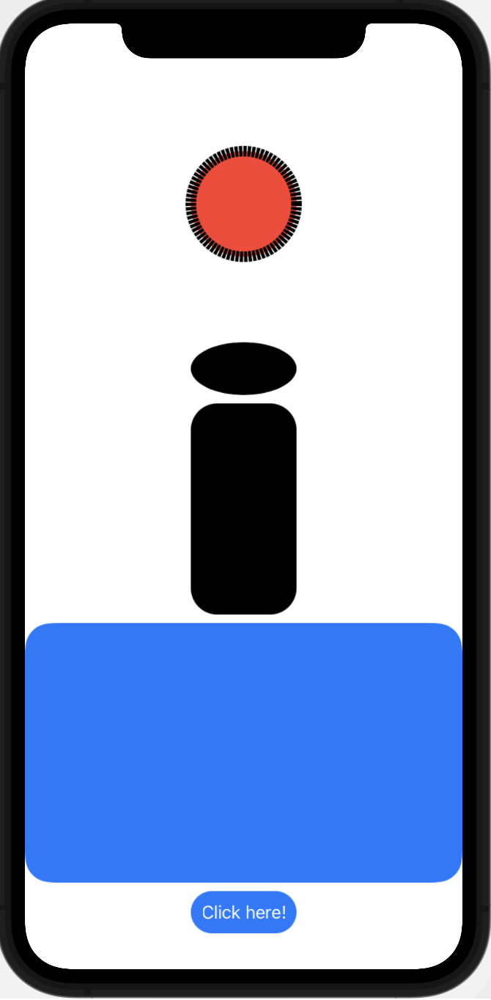
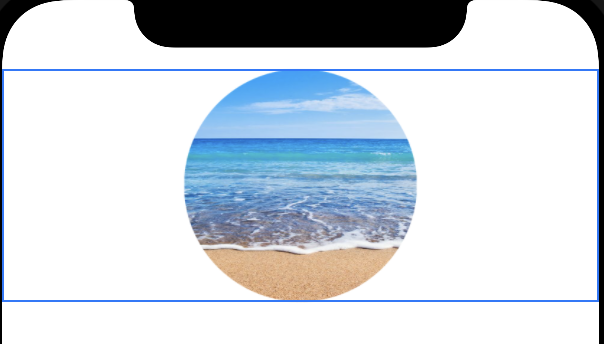

#  SwiftUI Shapes
Why create/ draw your own shape in SwiftUI? Because these shapes load much faster! They do not take up
as much memory either as using a pre-built image. In addition, they allow you to transform, modify and 
transform the shapes as you see fit.

# Available Shapes
In SwiftUI, there are five shapes:
1) Circle
1) Ellipse
1) Rectangle
1) Rounded Rectangle
1) Capsule



# Clipped Images
The `.clip` modifier allows you to easily constrain/ crop an image into a particular shape.
This comes in handy, if you want your button to be an image, or if you want to use that profile
icon in your app with someone's photo:
```
Image("beach")
    // Makes fit on entire screen
    .resizable()
    // Crop the image into a Circle
    .clipShape(Circle())
```


